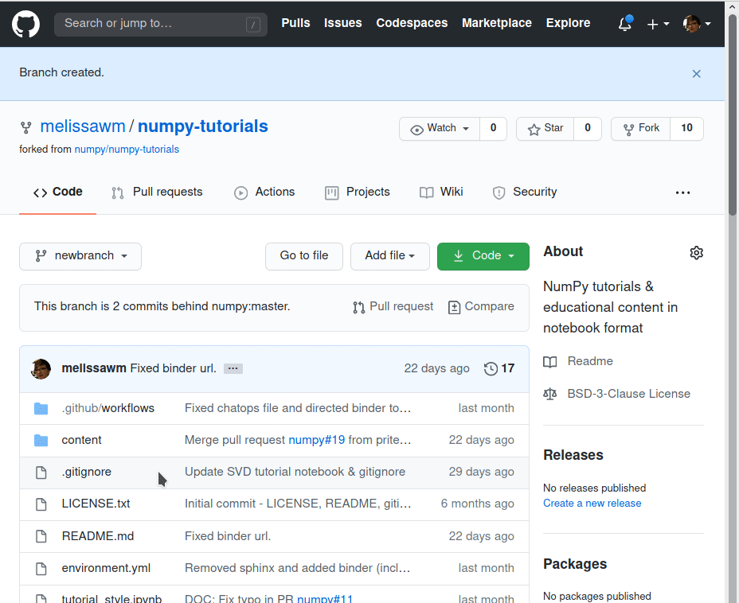
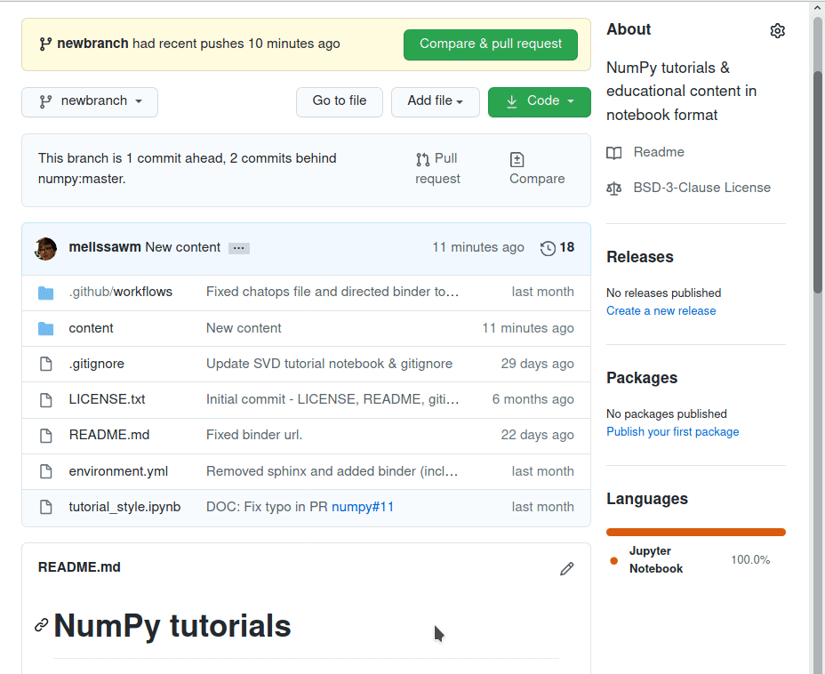

# Contributing

We very much welcome contributions! If you have an idea or proposal for a new
tutorial, please [open an issue](https://github.com/numpy/numpy-tutorials/issues)
with an outline.

Don’t worry if English is not your first language, or if you can only come up
with a rough draft. Open source is a community effort. Do your best – we’ll help
fix issues.

Images and real-life data make text more engaging and powerful, but be sure what
you use is appropriately licensed and available. Here again, even a rough idea
for artwork can be polished by others.

## Building the website

```{note}
The NumPy tutorials are powered by [`jupyter-book`][jb-docs] and the
[`MyST` document engine][mystmd].
See the linked documentation for further details.
```

[jb-docs]: https://jupyterbook.org/stable/
[mystmd]: https://mystmd.org/

### Quickstart

Set up a development environment with the dependencies listed in
`requirements.txt` and `site/requirements.txt`.
For example, using the built-in [`venv`][venv] module:

```bash
python -m venv np-tutorials
source np-tutorials/bin/activate
python -m pip install -r requirements.txt -r site/requirements.txt
```

[venv]: https://docs.python.org/3/library/venv.html

The site can then be built with:

```bash
jupyter-book start --execute
```

This will execute all the notebooks and start a web server to view the rendered
content locally.
View the rendered site by opening the ``localhost:30xy`` in your preferred browser (the exact port number will be printed in your terminal).

## Adding your own tutorials

If you have your own tutorial in the form of a Jupyter notebook (an `.ipynb`
file) and you'd like to try add it out to the repository, follow the steps below.

### Create an issue

Go to <https://github.com/numpy/numpy-tutorials/issues> and create a new issue
with your proposal.
Give as much detail as you can about what kind of content you would like to
write (tutorial, how-to) and what you plan to cover.
We will try to respond as quickly as possible with comments, if applicable.

### Check out our suggested template

You can use this template to make your content consistent with our existing
tutorials.

### Upload your content

Remember to clear all outputs on your notebook before uploading it.

<ul>
<details>
    <summary>
        <b>Fork this repository</b> (if you haven't before).
    </summary>
    
</details>

<details>
    <summary>
        <b>In your own fork, create a new branch for your content.</b>
    </summary>
    
</details>

<details>
    <summary>
        <b>Add your notebook to the <code>content/</code> directory.</b>
    </summary>
    
</details>

<b>Update the <code>environment.yml</code> file with the dependencies for your tutorial</b>
(only if you add new dependencies).

<details>
    <summary>
        <b>Update this <code>README.md</code> to include your new entry.</b>
    </summary>
    
</details>

<details>
    <summary>
        <b>Create a <a href="https://docs.github.com/en/github/collaborating-with-issues-and-pull-requests/about-pull-requests">pull request.</a> Make sure the "Allow edits and access to secrets by maintainers" option is selected so we can properly review your submission.</b>
    </summary>
    
</details>

🎉 <b>Wait for review!</b>
</ul>

For more information about GitHub and its workflow, you can see
[this document][collab].

[collab]: https://docs.github.com/en/github/collaborating-with-issues-and-pull-requests
