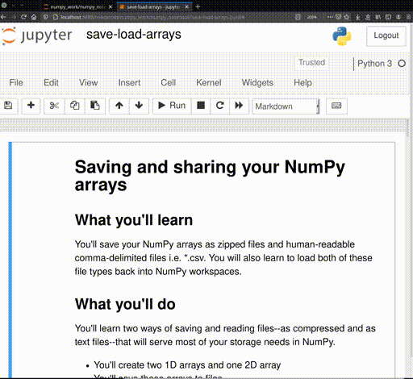
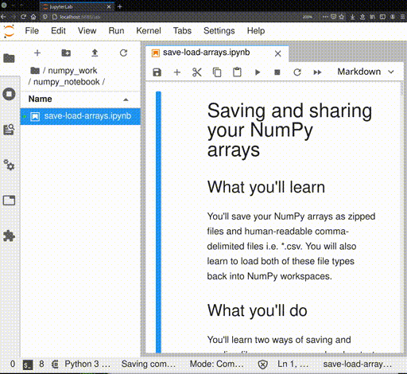

---
jupytext:
  formats: ipynb,md:myst
  text_representation:
    extension: .md
    format_name: myst
    format_version: 0.13
    jupytext_version: 1.11.1
kernelspec:
  display_name: Python 3
  language: python
  name: python3
---

# Pairing Jupyter notebooks and MyST-NB

## What you'll do
This guide will keep a Jupyter notebook synced _or paired_ between
`.ipynb` and `.md`.

## What you'll learn
- The difference between Jupyter's json format and MyST-NB's markdown
  format
- The benefits and drawbacks of json and markdown
- How to keep `.ipynb` and `.md` files in sync

## What you'll need
- [Jupyter](https://jupyter.org/)
- [Jupytext](https://jupytext.readthedocs.io/en/latest/index.html)

---
## Background

The [NumPy tutorials](https://github.com/numpy/numpy-tutorials) are
reviewed and executed as [MyST-NB](https://myst-nb.readthedocs.io/)
notebooks. Content is easier to review in this markdown format. You can
keep your `.ipynb` in sync with the content on NumPy tutorials. The
NumPy tutorials use
[Jupytext](https://jupytext.readthedocs.io/en/latest/index.html) to
convert your `.ipynb` file to [MyST
Markdown](https://github.com/mwouts/jupytext/blob/master/docs/formats.md#myst-markdown)
format.

Jupyter notebooks are stored on your disk in a
[json format](https://nbformat.readthedocs.io/en/latest/format_description.html). The json format is
very powerful and allows you to store almost any input and output that
Python libraries can create. The drawback is that it is hard to see and compare changes made in the notebook file when reviewing pull requests, because this means the reviewers are looking only at the raw json files.

MyST-NB notebooks are stored on your disk in a
[markdown](https://en.wikipedia.org/wiki/Markdown) format. The markdown
format is a lightweight markup language. Its key design goal is
[_readability_](https://daringfireball.net/projects/markdown/syntax#philosophy).
The drawback is that markdown can only store the inputs of your code.
Each time you open the notebook, you must execute the inputs to see the
output.

> __Note:__ You should use [common mark](https://commonmark.org)
> markdown cells. Jupyter only renders common mark markdown, but MyST-NB
> supports a variety of restructured text directives.  These Sphinx
> markdown directives will render when NumPy tutorials are built into a
> static website, but they will show up as raw code when you open in
> Jupyter locally or on [Binder](https://mybinder.org).

Consider these two versions of the same __Simple notebook example__. You
have three things in the notebooks:

1. A markdown cell that explains the code
    ```This code calculates 2+2 and prints the output.```
2. A code cell that shows the code
    ```python
    x = 2 + 2
    print('x = ', x)
    ```
3. The output of the code cell
    ```python
	x = 4
	```
---
__<center> Simple notebook example </center>__
This code calculates 2+2 and prints the output.

```{code-cell}
x = 2 + 2
print("x = ", x)
```

---

Here are the two Simple notebook example raw inputs side-by-side:

<table>
<tr>
<th>json <code>.ipynb</code></th>
<th>MyST-NB <code>.md</code></th>
</tr>
<tr>
<td>

```json
{
 "cells": [
  {
   "cell_type": "markdown",
   "metadata": {},
   "source": [
    "This code calculates 2+2 and prints the output"
   ]
  },
  {
   "cell_type": "code",
   "execution_count": 1,
   "metadata": {},
   "outputs": [
    {
     "name": "stdout",
     "output_type": "stream",
     "text": [
      "x =  4\n"
     ]
    }
   ],
   "source": [
    "x = 2 + 2\n",
    "print('x = ', x)"
   ]
  }
 ],
 "metadata": {
  "kernelspec": {
   "display_name": "Python 3",
   "language": "python",
   "name": "python3"
  },
  "language_info": {
   "codemirror_mode": {
    "name": "ipython",
    "version": 3
   },
   "file_extension": ".py",
   "mimetype": "text/x-python",
   "name": "python",
   "nbconvert_exporter": "python",
   "pygments_lexer": "ipython3",
   "version": "3.8.3"
  }
 },
 "nbformat": 4,
 "nbformat_minor": 4
}
```

</td>

<td>

````
---
jupytext:
  formats: ipynb,md:myst
  text_representation:
    extension: .md
    format_name: myst
    format_version: 0.12
    jupytext_version: 1.6.0
kernelspec:
  display_name: Python 3
  language: python
  name: python3
---

This code calculates 2+2 and prints the output

```{code-cell} ipython3
x = 2 + 2
print('x = ', x)
```
````
</td>
</tr>
</table>

The MyST-NB `.md` is much shorter, but it does not save the output `4`.


## Pair your notebook files `.ipynb` and `.md`

When you submit a Jupyter notebook to NumPy tutorials, we (the reviewers) will convert
it to a MyST-NB format. You can also submit the MyST-NB `.md` in your
pull request.
To keep the `.ipynb` and `.md` in sync--_or paired_--you need
[Jupytext](https://jupytext.readthedocs.io/en/latest/index.html).

Install `jupytext` using:

```
pip install jupytext
```
or
```
conda install jupytext -c conda-forge
```

Once installed, start your `jupyter lab` or `jupyter notebook`
session in the browser. When launching `jupyter lab` it will ask you to rebuild
to include the Jupytext extension.

You can pair the two formats in the classic Jupyter, Jupyter Lab,
or the command line:

```{admonition} **1. Classic Jupyter Jupytext pairing**
:class: toggle


```

```{admonition} **2. JupyterLab Jupytext pairing**
:class: toggle


```

````{admonition} **3. Command line Jupytext pairing**
:class: toggle

```sh
jupytext --set-formats ipynb,myst notebook.ipynb
```

Then, update either the MyST markdown or notebook file:

```sh
jupytext --sync notebook.ipynb
```
````

> __Note:__ With Jupytext installed, the classic Jupyter interface will
> automatically open MyST files as notebooks. In JupyterLab, you can
> right-click and choose "Open With -> Notebook" to open as a notebook.
> The outputs of your code cells are only saved in the `.ipynb` file.

## Wrapping up

In this tutorial, you saw the json `.ipynb` and MyST-NB `.md` raw code
to create Jupyter notebooks. You can use both formats to create
tutorials. Now you can work in either a simple text editor like VIM
or emacs or continue building notebooks in your browser. Jupytext can
handle pairing to keep your work in sync.
