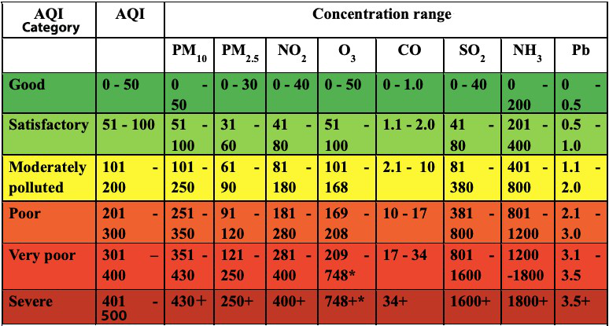
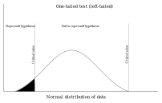
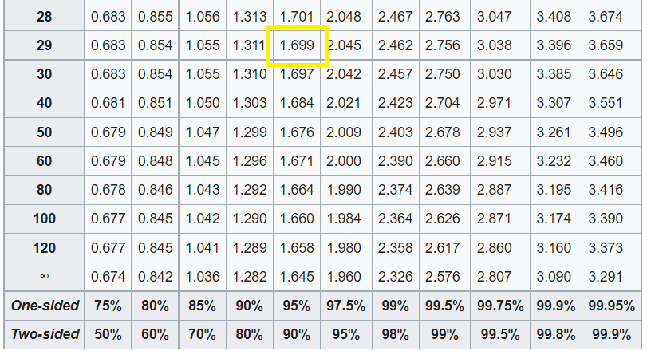

---
jupytext:
  formats: ipynb,md:myst
  text_representation:
    extension: .md
    format_name: myst
    format_version: 0.13
    jupytext_version: 1.11.5
kernelspec:
  display_name: Python 3 (ipykernel)
  language: python
  name: python3
---

# Analyzing the impact of the lockdown on air quality in Delhi, India


## What you'll do

Calculate Air Quality Indices (AQI) and perform paired Student's t-test on them.

## What you'll learn

- You'll learn the concept of moving averages

- You'll learn how to calculate Air Quality Index (AQI)

- You'll learn how to perform a paired Student's t-test and find the `t` and `p` values

- You'll learn how to interpret these values


## What you'll need

- [SciPy](https://scipy.org/install/) installed in your environment

- Basic understanding of statistical terms like population, sample, mean, standard deviation etc.


***

+++

## The problem of air pollution

Air pollution is one of the most prominent types of pollution we face that has an immediate effect on our daily lives. The
COVID-19 pandemic resulted in lockdowns in different parts of the world; offering a rare opportunity to study the effect of
human activity (or lack thereof) on air pollution. In this tutorial, we will study the air quality in Delhi, one of the
worst affected cities by air pollution, before and during the lockdown from March to June 2020. For this, we will first compute
the Air Quality Index for each hour from the collected pollutant measurements. Next, we will sample these indices and perform
a [paired Student's t-test](https://en.wikipedia.org/wiki/Student%27s_t-test#Dependent_t-test_for_paired_samples) on them. It will statistically show us that the air quality improved due to the lockdown, supporting our intuition.

Let's start by importing the necessary libraries into our environment.

```{code-cell} ipython3
import numpy as np
from numpy.random import default_rng
from scipy import stats
```

## Building the dataset

We will use a condensed version of the [Air Quality Data in India](https://www.kaggle.com/rohanrao/air-quality-data-in-india) dataset. This dataset contains air quality data and AQI (Air Quality Index) at hourly and daily level of various stations across multiple cities in India. The condensed version available with this tutorial contains hourly pollutant measurements for Delhi
from May 31, 2019 to June 30, 2020. It has measurements of the standard pollutants that are required for Air Quality Index calculation and a few other important ones:
Particulate Matter (PM 2.5 and PM 10), nitrogen dioxide (NO2), ammonia (NH3), sulfur dioxide (SO2), carbon monoxide (CO), ozone (O3), oxides of nitrogen (NOx), nitric oxide (NO), benzene, toluene, and xylene.

Let's print out the first few rows to have a glimpse of our dataset.

```{code-cell} ipython3
! head air-quality-data.csv
```

For the purpose of this tutorial, we are only concerned with standard pollutants required for calculating the AQI, viz., PM 2.5, PM 10, NO2, NH3, SO2, CO, and O3. So, we will only import these particular columns with [np.loadtxt](https://numpy.org/devdocs/reference/generated/numpy.loadtxt.html). We'll then [slice](https://numpy.org/devdocs/glossary.html#term-0) and create two sets: `pollutants_A` with PM 2.5, PM 10, NO2, NH3, and SO2, and `pollutants_B` with CO and O3. The
two sets will be processed slightly differently, as we'll see later on.

```{code-cell} ipython3
pollutant_data = np.loadtxt("air-quality-data.csv", dtype=float, delimiter=",",
                            skiprows=1, usecols=range(1, 8))
pollutants_A = pollutant_data[:, 0:5]
pollutants_B = pollutant_data[:, 5:]

print(pollutants_A.shape)
print(pollutants_B.shape)
```

Our dataset might contain missing values, denoted by `NaN`, so let's do a quick check with [np.isfinite](https://numpy.org/devdocs/reference/generated/numpy.isfinite.html).

```{code-cell} ipython3
np.all(np.isfinite(pollutant_data))
```

With this, we have successfully imported the data and checked that it is complete. Let's move on to the AQI calculations!

+++

## Calculating the Air Quality Index


We will calculate the AQI using [the method](https://app.cpcbccr.com/ccr_docs/FINAL-REPORT_AQI_.pdf) adopted by the [Central Pollution Control Board](https://www.cpcb.nic.in/national-air-quality-index) of India.  To summarize the steps:

- Collect 24-hourly average concentration values for the standard pollutants; 8-hourly in case of CO and O3.


- Calculate the sub-indices for these pollutants with the formula:


    $$
    Ip = \dfrac{\text{IHi – ILo}}{\text{BPHi – BPLo}}\cdot{\text{Cp – BPLo}} + \text{ILo}
    $$


    Where,

    `Ip` = sub-index of pollutant `p`\
    `Cp` = averaged concentration of pollutant `p`\
    `BPHi` = concentration breakpoint i.e. greater than or equal to `Cp`\
    `BPLo` = concentration breakpoint i.e. less than or equal to `Cp`\
    `IHi` = AQI value corresponding to `BPHi`\
    `ILo` = AQI value corresponding to `BPLo`
    

- The maximum sub-index at any given time is the Air Quality Index.
    
The Air Quality Index is calculated with the help of breakpoint ranges as shown in the chart below.




Let's create two arrays to store the AQI ranges and breakpoints so that we can use them later for our calculations.

```{code-cell} ipython3
AQI = np.array([0, 51, 101, 201, 301, 401, 501])

breakpoints = {
    'PM2.5': np.array([0, 31, 61, 91, 121, 251]),
    'PM10': np.array([0, 51, 101, 251, 351, 431]),
    'NO2': np.array([0, 41, 81, 181, 281, 401]),
    'NH3': np.array([0, 201, 401, 801, 1201, 1801]),
    'SO2': np.array([0, 41, 81, 381, 801, 1601]),
    'CO': np.array([0, 1.1, 2.1, 10.1, 17.1, 35]),
    'O3': np.array([0, 51, 101, 169, 209, 749])
}
```

### Moving averages

For the first step, we have to compute [moving averages](https://en.wikipedia.org/wiki/Moving_average) for `pollutants_A` over a window of 24 hours and `pollutants_B` over a
window of 8 hours. We will write a simple function `moving_mean` using [np.cumsum](https://numpy.org/devdocs/reference/generated/numpy.cumsum.html) and [sliced indexing](https://numpy.org/devdocs/user/basics.indexing.html#slicing-and-striding) to achieve this.

To make sure both the sets are of the same length, we will truncate the `pollutants_B_8hr_avg` according to the length of
`pollutants_A_24hr_avg`. This will also ensure we have concentrations for all the pollutants over the same period of time.

```{code-cell} ipython3
def moving_mean(a, n):
    ret = np.cumsum(a, dtype=float, axis=0)
    ret[n:] = ret[n:] - ret[:-n]
    return ret[n - 1:] / n

pollutants_A_24hr_avg = moving_mean(pollutants_A, 24)
pollutants_B_8hr_avg = moving_mean(pollutants_B, 8)[-(pollutants_A_24hr_avg.shape[0]):]
```

Now, we can join both sets with [np.concatenate](https://numpy.org/devdocs/reference/generated/numpy.concatenate.html) to form a single data set of all the averaged concentrations. Note that we have to join our arrays column-wise so we pass the
`axis=1` parameter.

```{code-cell} ipython3
pollutants = np.concatenate((pollutants_A_24hr_avg, pollutants_B_8hr_avg), axis=1)
```

### Sub-indices

The subindices for each pollutant are calculated according to the linear relationship between the AQI and standard breakpoint ranges with the formula as above: 

$$
Ip = \dfrac{\text{IHi – ILo}}{\text{BPHi – BPLo}}\cdot{\text{Cp – BPLo}} + \text{ILo}
$$

The `compute_indices` function first fetches the correct upper and lower bounds of AQI categories and breakpoint concentrations for the input concentration and pollutant with the help of arrays `AQI` and `breakpoints` we created above. Then, it feeds these values into the formula to calculate the sub-index.

```{code-cell} ipython3
def compute_indices(pol, con):
    bp = breakpoints[pol]
    
    if pol == 'CO':
        inc = 0.1
    else:
        inc = 1
    
    if bp[0] <= con < bp[1]:
        Bl = bp[0]
        Bh = bp[1] - inc
        Ih = AQI[1] - inc
        Il = AQI[0]

    elif bp[1] <= con < bp[2]:
        Bl = bp[1]
        Bh = bp[2] - inc
        Ih = AQI[2] - inc
        Il = AQI[1]

    elif bp[2] <= con < bp[3]:
        Bl = bp[2]
        Bh = bp[3] - inc
        Ih = AQI[3] - inc
        Il = AQI[2]

    elif bp[3] <= con < bp[4]:
        Bl = bp[3]
        Bh = bp[4] - inc
        Ih = AQI[4] - inc
        Il = AQI[3]

    elif bp[4] <= con < bp[5]:
        Bl = bp[4]
        Bh = bp[5] - inc
        Ih = AQI[5] - inc
        Il = AQI[4]

    elif bp[5] <= con:
        Bl = bp[5]
        Bh = bp[5] + bp[4] - (2 * inc)
        Ih = AQI[6]
        Il = AQI[5]

    else:
        print("Concentration out of range!")
        
    return ((Ih - Il) / (Bh - Bl)) * (con - Bl) + Il
```

We will use [np.vectorize](https://numpy.org/devdocs/reference/generated/numpy.vectorize.html) to utilize the concept of vectorization. This simply means we don't have loop over each element of the pollutant array ourselves. [Vectorization](https://numpy.org/devdocs/user/whatisnumpy.html#why-is-numpy-fast) is one of the key advantages of NumPy.

```{code-cell} ipython3
vcompute_indices = np.vectorize(compute_indices)
```

By calling our vectorized function `vcompute_indices` for each pollutant, we get the sub-indices. To get back an array with the original shape, we use [np.stack](https://numpy.org/devdocs/reference/generated/numpy.stack.html).

```{code-cell} ipython3
sub_indices = np.stack((vcompute_indices('PM2.5', pollutants[..., 0]),
                        vcompute_indices('PM10', pollutants[..., 1]),
                        vcompute_indices('NO2', pollutants[..., 2]),
                        vcompute_indices('NH3', pollutants[..., 3]),
                        vcompute_indices('SO2', pollutants[..., 4]),
                        vcompute_indices('CO', pollutants[..., 5]),
                        vcompute_indices('O3', pollutants[..., 6])), axis=1)
```

### Air quality indices

Using [np.max](https://numpy.org/devdocs/reference/generated/numpy.maximum.html), we find out the maximum sub-index for each period, which is our Air Quality Index!

```{code-cell} ipython3
aqi_array = np.max(sub_indices, axis=1)
```

With this, we have the AQI for every hour from June 1, 2019 to June 30, 2020. Note that even though we started out with
the data from 31st May, we truncated that during the moving averages step.

+++

## Paired Student's t-test on the AQIs

Hypothesis testing is a form of descriptive statistics used to help us make decisions with the data. From the calculated AQI data, we want to find out if there was a statistically significant difference in average AQI before and after the lockdown was imposed. We will use the left-tailed, [paired Student's t-test](https://en.wikipedia.org/wiki/Student%27s_t-test#Dependent_t-test_for_paired_samples) to compute two test statistics- the [`t statistic`](https://en.wikipedia.org/wiki/T-statistic) and the [`p value`](https://en.wikipedia.org/wiki/P-value). We will then compare these with the corresponding critical values to make a decision.



### Sampling

We will now import the `datetime` column from our original dataset into a [*datetime64* dtype](https://numpy.org/devdocs/reference/arrays.scalars.html) array. We will use this array to index the AQI array and obtain subsets of the dataset.

```{code-cell} ipython3
datetime = np.loadtxt("air-quality-data.csv", dtype='M8[h]', delimiter=",",
                         skiprows=1, usecols=(0, ))[-(pollutants_A_24hr_avg.shape[0]):]
```

Since total lockdown commenced in Delhi from March 24, 2020, the after-lockdown subset is of the period March 24, 2020 to June 30, 2020. The before-lockdown subset is for the same length of time before 24th March.

```{code-cell} ipython3
after_lock = aqi_array[np.where(datetime >= np.datetime64('2020-03-24T00'))]

before_lock = aqi_array[np.where(datetime <= np.datetime64('2020-03-21T00'))][-(after_lock.shape[0]):]

print(after_lock.shape)
print(before_lock.shape)
```

To make sure our samples are *approximately* normally distributed, we take samples of size `n = 30`. `before_sample` and `after_sample` are the set of random observations drawn before and after the total lockdown. We use [random.Generator.choice](https://numpy.org/devdocs/reference/random/generated/numpy.random.Generator.choice.html) to generate the samples.

```{code-cell} ipython3
rng = default_rng()

before_sample = rng.choice(before_lock, size=30, replace=False)
after_sample = rng.choice(after_lock, size=30, replace=False)
```

### Defining the hypothesis

Let us assume that there is no significant difference between the sample means before and after the lockdown. This will be the null hypothesis. The alternative hypothesis would be that there *is* a significant difference between the means and the AQI *improved*. Mathematically,

$H_{0}: \mu_\text{after-before} = 0$ \
$H_{a}: \mu_\text{after-before} < 0$

+++

### Calculating the test statistics

We will use the `t` statistic to evaluate our hypothesis and even calculate the `p value` from it. The formula for the `t` statistic is:

$$
t = \frac{\mu_\text{after-before}}{\sqrt{\sigma^{2}/n}}
$$

where,

$\mu_\text{after-before}$ = mean differences of samples \
$\sigma^{2}$ = variance of mean differences \
$n$ = sample size

```{code-cell} ipython3
def t_test(x, y):
    diff = y - x
    var = np.var(diff, ddof=1)
    num = np.mean(diff)
    denom = np.sqrt(var / len(x))
    return np.divide(num, denom)

t_value = t_test(before_sample, after_sample)
```

For the `p` value, we will use SciPy's `stats.distributions.t.cdf()` function. It takes two arguments- the `t statistic` and the degrees of freedom (`dof`). The formula for `dof` is `n - 1`.

```{code-cell} ipython3
dof = len(before_sample) - 1

p_value = stats.distributions.t.cdf(t_value, dof)

print("The t value is {} and the p value is {}.".format(t_value, p_value))
```

## What do the `t` and `p` values mean?

We will now compare the calculated test statistics with the critical test statistics. The critical `t` value is calculated by looking up the [t-distribution table](https://en.wikipedia.org/wiki/Student%27s_t-distribution#Table_of_selected_values).



From the table above, the critical value is 1.699 for 29 `dof` at a confidence level of 95%. Since we are using the left tailed test, our critical value is -1.699. Clearly, the calculated `t` value is less than the critical value so we can safely reject the null hypothesis.

The critical `p` value, denoted by $\alpha$, is usually chosen to be 0.05, corresponding to a confidence level of 95%. If the calculated `p` value is less than $\alpha$, then the null hypothesis can be safely rejected. Clearly, our `p` value is much less than $\alpha$, so we can reject the null hypothesis.

Note that this does not mean we can accept the alternative hypothesis. It only tells us that there is not enough evidence to reject $H_{a}$. In other words, we fail to reject the alternative hypothesis so, it *may* be true.

+++

***

## In practice...

- The [pandas](https://pandas.pydata.org/) library is preferable to use for time-series data analysis.

- The SciPy stats module provides the [stats.ttest_rel](https://docs.scipy.org/doc/scipy/reference/generated/scipy.stats.ttest_rel.html) function which can be used to get the `t statistic` and `p value`.

- In real life, data are generally not normally distributed. There are tests for such non-normal data like the [Wilcoxon test](https://en.wikipedia.org/wiki/Wilcoxon_signed-rank_test).

## Further reading

- There are a host of statistical tests you can choose according to the characteristics of the given data. Read more about them at
[A Gentle Introduction to Statistical Data Distributions](https://machinelearningmastery.com/statistical-data-distributions/).

- There are various versions of the [Student's t-test](https://en.wikipedia.org/wiki/Student%27s_t-test) that you can adopt according to your needs.
