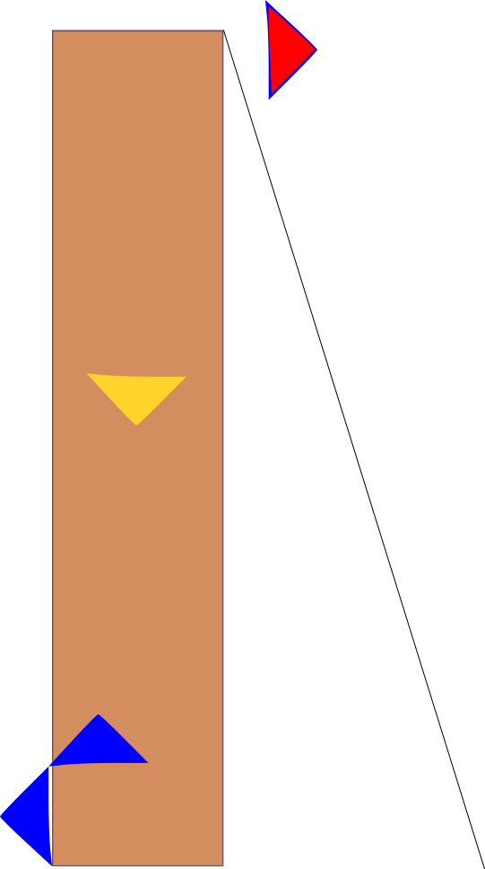

---
jupytext:
  formats: ipynb,md:myst
  text_representation:
    extension: .md
    format_name: myst
    format_version: 0.12
    jupytext_version: 1.9.1
kernelspec:
  display_name: Python 3
  language: python
  name: python3
---

# Determining Static Equilibrium in NumPY

When analyzing structures it is crucial to understand the mechanics keeping it stable. Applied forces on a floor, a beam, or any other structure, create reaction forces and moments. These reactions are the structure resisting movement without breaking. You will look at structures that do not move despite having forces applied to them. In this case Newton's second law states that both the acceleration and sum of forces in the system must be zero. Newton's second law describes the sum of forces in all directions. The reactions present must be equal and opposite to the sum of forces. You can represent and solve this concept with NumPy arrays.

## What you'll do:
- In this tutorial, you will use NumPy to create vectors and moments using NumPy arrays
- Solve for cables and floors holding up structures
- Write NumPy matrixes to isolate unkowns
- Use NumPy functions to perform linear algebra
    
## What you'll learn:
- How to represent points, vectors, and moments with NumPy.
- How to find the normal of vectors
- Using NumPy to compute matrix calculations
    
## What you'll need:
- NumPy
- matplotlib

imported with the following comands:

```{code-cell} ipython3
import numpy as np
import matplotlib.pyplot as plt
```

In this tutorial you will use the following NumPy tools:

`np.linalg.norm` : this function determines the measure of vector magnitude

`np.cross` : this function takes two matrices and produces the cross product

`plt.figure` : this function creates a figure

`Axes3D` : This gives the figure 3D axes

+++

# Solving equilibrium with Newton's second law

Your model consists of a beam under a sum of forces and moments. You can start analyzing this system with Newton's second law: 

$\ \sum{force} = mass * acceleration$.

In order to simplify the examples looked at, assume they are static, with $\ acceleration = 0$.  Due to our system existing in three dimensions, consider forces being applied in each.  This means that you can represent these forces as vectors. You come to the same conclusion for moments, which result from forces being applied a certain distance away from an object's center of mass.

$\ Example force = <F_{x},F_{y},F_{z}>$

$\ Example Moment = <r_{x},r_{y},r_{z}>\times<F_{x},F_{y},F_{z}>$

$\ \sum{force} = 0$

$\ \sum{moment} = 0$

where F represents the magnitude of the force being applied in each corresponding direction and r is the distance that the force is applied from the centroid of the system. In this convention assume each entry in a vector corresponds to $\ \hat{i}, \hat{j}, \hat{k}$ respectively.

Start with some simple examples of force vectors

```{code-cell} ipython3
forceA = np.array([1,0,0])
forceB = np.array([0,1,0])
print('Force A =', forceA)
print('Force B =', forceB)
```

This defines force A as being a vector with magnitude of 1 in the x direction and force B as magnitude 1 in the y direction.

Use matplotlib to visualize these forces.

```{code-cell} ipython3
fig = plt.figure()

d3 = fig.gca(projection='3d')

d3.set_xlim(-1,1)
d3.set_ylim(-1,1)
d3.set_zlim(-1,1)

x, y, z = np.array([0,0,0]) # defining the point of application.  Make it the origin

u, v, w = forceA # breaking the force vector into individual components
d3.quiver(x,y,z,u,v,w) # plotting forceA

u, v, w = forceB
d3.quiver(x,y,z,u,v,w) # plotting forceB

plt.show()
```

There are two forces eminating from a single point.

In order to simplify this problem, you can add them together to find the sum of forces.

```{code-cell} ipython3
forceC = forceA + forceB
print('Force C =', forceC)
```

Force C now acts as a single force that represents both A and B.
You can plot it to see the result.

```{code-cell} ipython3
fig = plt.figure()

d3 = fig.gca(projection='3d')

d3.set_xlim(-1,1)
d3.set_ylim(-1,1)
d3.set_zlim(-1,1)

x, y, z = np.array([0,0,0])

u, v, w = forceC
d3.quiver(x,y,z,u,v,w)

plt.show()
```

There is now a single vector at the origin.
However, the goal is equilibrium.
This means that you want your sum of forces to be <0,0,0> or else your object will experience acceleration
Therefore, there needs to be another force that counteracts the prior ones.

You can write this problem as $\ A+B+R=0$,
with R being the reaction force that solves the problem.

In this example this would mean:

$\ <1,0,0>+<0,1,0>+<R_{x},R_{y},R_{z}>=<0,0,0>$

Broken into x, y, and z components this gives you:

$\ 1+0+R_{x}=0$

$\ 0+1+R_{y}=0$

$\ 0+0+R_{z}=0$

solving for R_{x}, R_{y}, and R_{z} gives you a vector R of <-1,-1,0>.

Plot this and see if it works.

```{code-cell} ipython3
R = np.array([-1,-1,0])

fig = plt.figure()

d3.set_xlim(-1,1)
d3.set_ylim(-1,1)
d3.set_zlim(-1,1)

d3 = fig.gca(projection='3d')

x, y, z = np.array([0,0,0])

u, v, w = forceA + forceB + R # add them all together for sum of forces
d3.quiver(x,y,z,u,v,w)

plt.show()
```

The empty graph signifies that there are no outlying forces. This denotes a system in equilibrium.


# Solving Equilibrium as a sum of moments

Next let's move to a more complicated application.
When forces are not all applied at the same point moments are created.
Similar to forces, these moments must all sum to zero, otherwise rotationial acceleration will be experienced.  Similar to sum of forces, this creates a linear equation for each of $\ \hat{i}, \hat{j}, \hat{k}$.

A simple example of this would be from a force applied to a stationary pole secured in the ground.
The pole does not move, so it must apply a reaction force.
The pole also does not rotate, so it must also be creating a reaction moment.
Solve for both.

Lets say a 5N force is applied 2m above the base of the pole.

```{code-cell} ipython3
f = 5
L = 2

R = 0 - f
M = 0 - f*L
print('Reaction force =',R)
print('Reaction moment =',M)
```

# Finding values with physical properties

Let's say that instead of a force acting perpendicularly to the beam, a force was applied to our pole through a wire that was also attached to the ground.
Given the tension in this cord, all you need to solve this problem are the physical locations of these objects.



In response to the forces acting upon the pole, the base generated reaction forces in the x and y directions, as well as a reaction moment.

Denote the base of the pole as the origin.
Now, say the cord is attached to the ground 3m in the x direction and attached to the pole 2m up, in the z direction.

Define these points in space as numpy arrays, and then use those arrays to find directional vectors.

```{code-cell} ipython3
poleBase = np.array([0,0,0])
cordBase = np.array([3,0,0])
cordConnection = np.array([0,0,2])

poleDirection = cordConnection - poleBase
print('Pole direction =',poleDirection)
cordDirection = cordBase - cordConnection
print('Cord direction =',cordDirection)
```

In order to use these vectors in relation to forces you need to convert them into unit vectors.
Unit vectors have a magnitude of one, and convey only the direction of the forces.

```{code-cell} ipython3
cordUnit = cordDirection/np.linalg.norm(cordDirection)
print('Cord unit vector =',cordUnit)
```

You can then multiply this direction with the magnitude of the force in order to find the force vector.

Let's say the cord has a tension of 5N

```{code-cell} ipython3
cordTension = 5
forceCord = cordUnit * cordTension
print('Force from the cord =',forceCord)
```

In order to find the moment you need the cross product of the force vector and the radius.

```{code-cell} ipython3
momentCord = np.cross(forceCord, poleDirection)
print('Moment from the cord =',momentCord)
```

Now all you need to do is find the reaction force and moment.

```{code-cell} ipython3
equilibrium = np.array([0,0,0])
R = equilibrium - forceCord
M = equilibrium - momentCord
print("Reaction force =",R)
print("Reaction moment =",M)
```

## Another Example
Let's look at a slightly more complicated model.  In this example you will be observing a beam with two cables and an applied force.  This time you need to find both the tension in the cords and the reaction forces of the beam.

[Vector Mechanics for Engineers: Statics](https://www.mheducation.com/highered/product/vector-mechanics-engineers-statics-beer-johnston/M9780077687304.html)

Problem 4.106


Define distance a as 3m

As before, start by defining the location of each relevant point as an array.

```{code-cell} ipython3
A = np.array([0,0,0])
B = np.array([0,3,0])
C = np.array([0,6,0])
D = np.array([1.5,0,-3])
E = np.array([1.5,0,3])
F = np.array([-3,0,2])
```

From these equations, you start by determining vector directions with unit vectors.

```{code-cell} ipython3
AB = B - C
AC = C - A
BD = D - B
BE = E - B
CF = F - C

UnitBD = BD/np.linalg.norm(BD)
UnitBE = BE/np.linalg.norm(BE)
UnitCF = CF/np.linalg.norm(CF)

RadBD = np.cross(AB,UnitBD)
RadBE = np.cross(AB,UnitBE)
RadCF = np.cross(AC,UnitCF)
```

This lets you represent the forces acting on the system as

$\left[
\begin{array}
~1/3 & 1/3 & 1 & 0 & 0\\
-2/3 & -2/3 & 0 & 1 & 0\\
-2/3 & 2/3 & 0 & 0 & 1\\
\end{array}
\right]
\left[
\begin{array}
~T_{BD}\\
T_{BE}\\
R_{x}\\
R_{y}\\
R_{z}\\
\end{array}
\right]
=
\left[
\begin{array}
~195\\
390\\
-130\\
\end{array}
\right]$

And the moments as

$\left[
\begin{array}
~2 & -2\\
1 & 1\\
\end{array}
\right]
\left[
\begin{array}
~T_{BD}\\
T_{BE}\\
\end{array}
\right]
=
\left[
\begin{array}
~780\\
1170\\
\end{array}
\right]$

Where T is the tesnion in the respective cord and R is the reaction force in a respective direction. Then you just have six equations:

$\sum F_{x} = 0 = T_{BE}/3+T_{BD}/3-195+R_{x}$

$\sum F_{y} = 0 = T_{BE}*-2/3-T_{BD}*2/3-390+R_{y}$

$\sum F_{z} = 0 = T_{BE}*-2/3+T_{BD}*2/3+130+R_{z}$

$\sum M_{x} = 0 = 780+2*T_{BE}-2*T_{BD}$

$\sum M_{z} = 0 = 1170-T_{BE}-T_{BD}$

You now have five unknowns with five equations, and can solve for:

$\ T_{BD} = 780N$

$\ T_{BE} = 390N$

$\ R_{x} = -195N$

$\ R_{y} = 1170N$

$\ R_{z} = 130N$

+++

# Wrapping up

You have learned how to use arrays to represent points, forces, and moments in three dimensional space. Each entry in an array can be used to represent a physical property broken into directional components. These can then be easily manipulated with NumPy functions.

## Additional Applications

This same process can be applied to kinetic problems or in any number of dimensions. The examples done in this tutorial assumed three dimensional problems in static equilibrium. These methods can easily be used in more varied problems. More or less dimensions require larger or smaller arrays to represent. In systems experiencing acceleration, velocity and acceleration can be similarly be represented as vectors as well.

## References

1. [Vector Mechanics for Engineers: Statics (Beer & Johnston & Mazurek)](https://www.mheducation.com/highered/product/vector-mechanics-engineers-statics-beer-johnston/M9780077687304.html)
2. [NumPy Reference](https://numpy.org/doc/stable/reference/)

```{code-cell} ipython3

```
