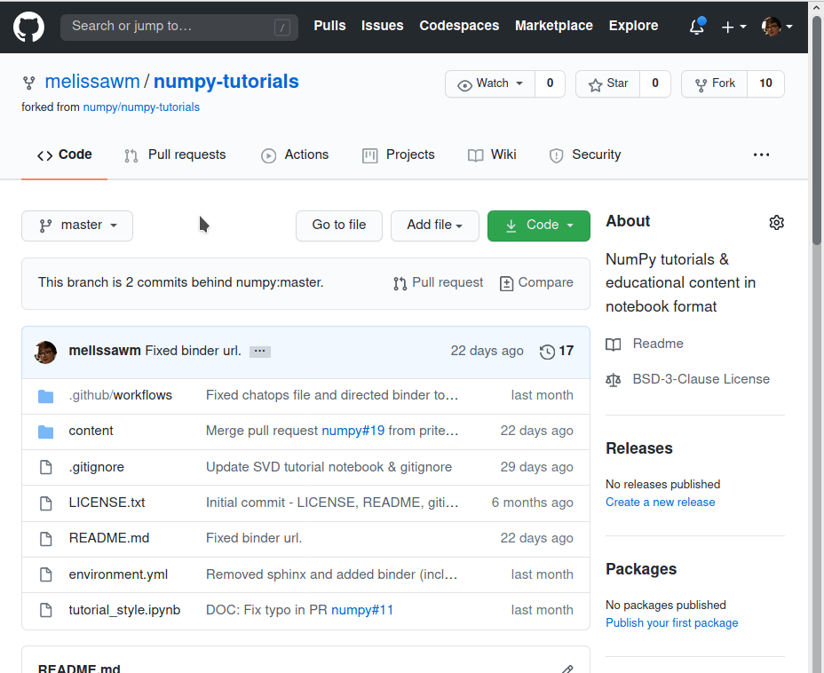

# NumPy tutorials

[][launch_binder]

[launch_binder]: http://mybinder.org/v2/gh/numpy/numpy-tutorials/master?urlpath=lab/tree/content

This set of tutorials and educational materials is being developed,
IT IS NOT INTEGRATED IN THE HTML DOCS AT <https://www.numpy.org/devdocs/>

The goal of this repository is to provide high-quality resources by the
NumPy project, both for self-learning and for teaching classes with. If you're
interested in adding your own content, check the [Contributing](#contributing)
section.

To open a live version of the content, click the **launch Binder** button above.
You can also launch individual tutorials on Binder by clicking on the
rocket icon that appears in the upper-right corner of each tutorial.
To download a local copy of the `.ipynb` files, you can either
[clone this repository](https://docs.github.com/en/github/creating-cloning-and-archiving-repositories/cloning-a-repository)
or use the download icon in the upper-right corner of each tutorial.

## Content

```{toctree}
---
maxdepth: 1
---

content/cs231_tutorial
content/tutorial-svd
```

### Attribution

 - The cs231n tutorial is by [@jcjohnson][jj]. The full tutorial in 
   its original form is linked via [numpy.org][learn].
 - The SVD tutorial is by [@melissawm][mwm]. The full tutorial is available
   via the [tutorials page][np_tutorials] of the official NumPy documentation.

[jj]: https://github.com/jcjohnson
[learn]: https://numpy.org/learn
[mwm]: https://github.com/melissawm
[np_tutorials]: https://numpy.org/devdocs/user/tutorials_index.html

## Contributing

We very much welcome contributions! If you have an idea or proposal for a new
tutorial, please [open an issue](https://github.com/numpy/numpy-tutorials/issues)
with an outline. 

Don’t worry if English is not your first language, or if you can only come up
with a rough draft. Open source is a community effort. Do your best – we’ll help
fix issues.

Images and real-life data make text more engaging and powerful, but be sure what
you use is appropriately licensed and available. Here again, even a rough idea
for artwork can be polished by others.

### Why Jupyter Notebooks?

The choice of Jupyter Notebook in this repo instead of the usual format 
([reStructuredText][rst])
used in the main NumPy documentation has two reasons:


 * Jupyter notebooks are a common format for communicating scientific
   information.
 * rST may present a barrier for some people who might otherwise be very
   interested in contributing tutorial material.

[rst]: https://www.sphinx-doc.org/en/master/usage/restructuredtext/index.html

### Adding your own tutorials

If you have your own tutorial in the form of a Jupyter notebook (an `.ipynb`
file) and you'd like to try add it out to the repository:

#### Create an issue

Go to <https://github.com/numpy/numpy-tutorials/issues> and create a new issue 
with your proposal.
Give as much detail as you can about what kind of content you would like to
write (tutorial, how-to) and what you plan to cover.
We will try to respond as quickly as possible with comments, if applicable.

#### Check out our suggested template

You can use this template to make your content consistent with our existing 
tutorials:

```{toctree}
---
maxdepth: 1
---
content/tutorial-style-guide
```

#### Upload your content

Remember to clear all outputs on your notebook before uploading it. 

<ul>
<details>
    <summary>
        <b>Fork this repository</b> (if you haven't before).
    </summary>
    
</details>
    
<details>
    <summary>
        <b>In your own fork, create a new branch for your content.</b>
    </summary>
    
</details>

<details>
    <summary>
        <b>Add your notebook to the <code>content/</code> directory.</b>
    </summary>
    
</details>

<b>Update the <code>environment.yml</code> file with the dependencies for your tutorial</b>
(only if you add new dependencies).

<details>
    <summary>
        <b>Update this <code>README.md</code> to include your new entry.</b>
    </summary>
    
</details>

<b>Update the attribution section (below) to credit the original tutorial
author, if applicable.</b>

<details>
    <summary>
        <b>Create a <a href="https://docs.github.com/en/github/collaborating-with-issues-and-pull-requests/about-pull-requests">pull request.</a></b>
    </summary>
    
</details>

🎉 <b>Wait for review!</b>
</ul>

For more information about GitHub and its workflow, you can see
[this document][collab].

[collab]: https://docs.github.com/en/github/collaborating-with-issues-and-pull-requests


## Useful links and resources

The following links may be useful:

- [NumPy Code of Conduct](https://numpy.org/doc/stable/dev/conduct/code_of_conduct.html)
- [Main NumPy documentation](https://numpy.org/doc/stable/)
- [NumPy documentation team meeting notes](https://hackmd.io/oB_boakvRqKR-_2jRV-Qjg?both)
- [NEP 44 - Restructuring the NumPy documentation](https://numpy.org/neps/nep-0044-restructuring-numpy-docs.html)
- [Blog post - Documentation as a way to build Community](https://labs.quansight.org/blog/2020/03/documentation-as-a-way-to-build-community/)

Note that regular documentation issues for NumPy can be found in the [main NumPy
repository](https://github.com/numpy/numpy/issues) (see the `Documentation`
labels there). 


## Indices and tables

* {ref}`genindex`
* {ref}`modindex`
* {ref}`search`
